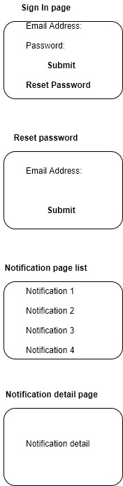
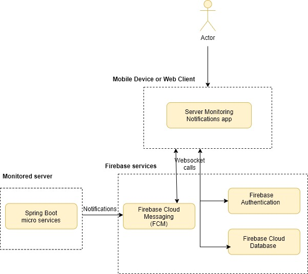
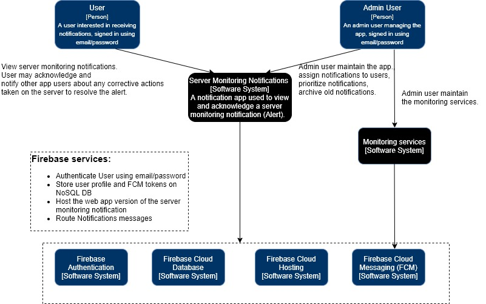
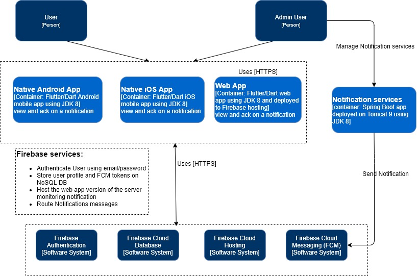
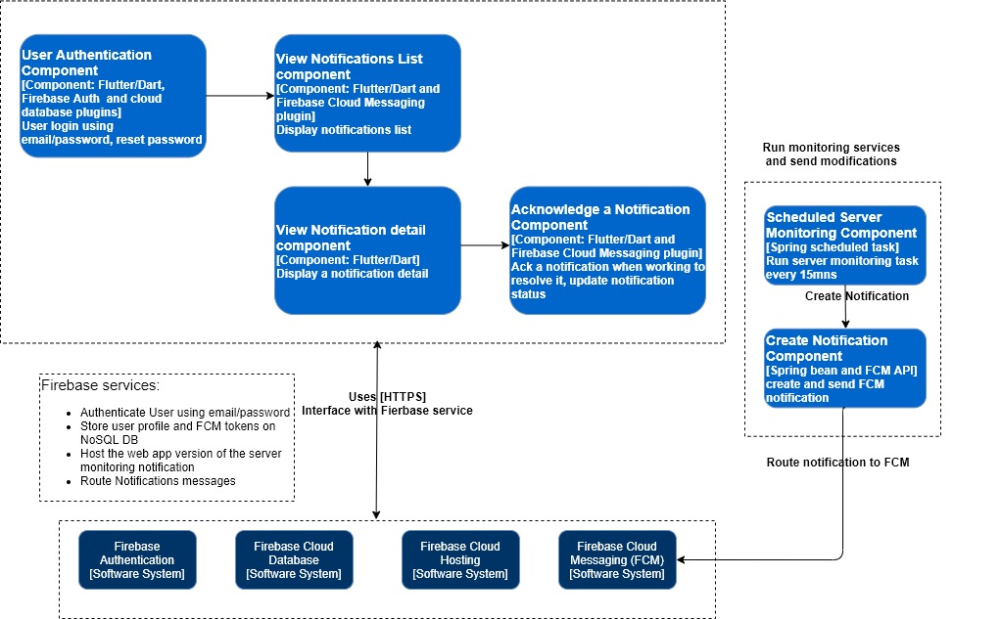

## User Stories

As a **User**, I want to **view the login page on Android phone**, so I can **log in to the app**.  
**Acceptance criteria**
   * Login page is displayed.

As a **User**, I want to **reset my default app password**, so I can **log in to the app with the new password**.  
**Acceptance criteria**
   * Login page has a link to reset password. 
   * Clicking on the reset password link will send an email to the user. The email content will have a Firebase authentication service link to change the password. 
   * User is able to login using the new password.

As a **User**, I want to **log in to the app**, so I can **view the notifications**.  
**Acceptance criteria**
   * User is able to login using his credentials (email/password).
   * Error message is displayed in case of logging error (wrong email or password).
   
As a **User**, I want to **view the list of notifications**, so I can **review the server issues**.  
**Acceptance criteria**
   * The notifications list page is displayed. 
   * The list is refreshed automatically when new notifications are added.
   * The list page contain a link to view the notification detail.

As a **User**, I want to **view the detail of the notification**, so I can **take action on the server to resolve the issue**.  
**Acceptance criteria**
   * The detail notification page is displayed when selecting a notification from the list (Master --> Detail view). 
   
As a **Admin**, I want to **start/stop the Spring Boot micro services**, so I can **send/stop server notifications**.  
**Acceptance criteria**
   * Admin user has a shell script available to start/stop the Spring Boot micro services. 

As a **Admin**, I want to **have access to the app Firebase console**, so I can **manage the users and server notifications**.  
**Acceptance criteria**
   * Admin user has read/write access to the Firebase console and can manage the app Firebase services. 

## Mis-user stories
I will assume that server monitoring notifications have sensitive informations like server names and they can not be read by any user.

As a **Malicious User**, I want to **hack access to the app using someone else's email address by resetting the password**, so I can **log in to the app and review the server notifications**.  
**Mitigation criteria**
   * Password can only be changed from the email sent to the user. If hacker does not have access to the email then password reset will not be possible. 

As a **Malicious User**, I want to **sign up to have access to the app**, so I can **log in to the app and review the server notifications**.  
**Mitigation criteria**
   * The App users are set and maintained by the app Admin. Signing up is not an option available.
   
As a **Malicious User**, I want to **inject fake notifications**, so I can **alert the real users of the app**.  
**Mitigation criteria**
   * OAUTH 2.0 authorization framework is used to communicate between the different components of the app.
   
## Diagrams

**Mockup pages**

 
  
   

**Architecture diagram**

      

      

      

      
